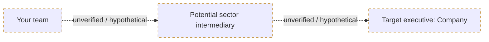

# Diagram rules

Use Mermaid `flowchart LR`. Validate syntax before delivering (use a Mermaid render tool when available).

## Mock relationship path

Rules:

- Keep the generic role nodes. Do not name a real intermediary.
- A sourced executive name may replace the company in the last node only if it is cited elsewhere in the report. Naming someone never implies a connection.
- Every edge keeps the label `unverified / hypothetical` and a dotted line.
- Next action stays "Validate introduction route".
